<div align="center">


<br/>


<br/><br/>

**Cascade** reorders the functions in a C++ source file into *call order* — callers first,
callees below — following the **Stepdown Rule** from *Clean Code*, and sorts your `#include`s
along the way. Read a file top to bottom and it reads like prose.

</div>

---

## ◈ What it does

<table>
<tr>
<td width="34" align="center"><b>▹</b></td>
<td><b>Call-order reorder.</b> Builds a call graph of every function, then lays them out so each function appears <i>above</i> the ones it calls (DFS stepdown).</td>
</tr>
<tr>
<td align="center"><b>▹</b></td>
<td><b>Sorted includes.</b> Only <code>#include</code> lines are sorted; stray blank lines are dropped, comments kept.</td>
</tr>
<tr>
<td align="center"><b>▹</b></td>
<td><b>Non-destructive by default.</b> Writes <code>&lt;name&gt;_new.&lt;ext&gt;</code> next to the original and never touches your file — unless you opt into <code>--in-place</code>.</td>
</tr>
<tr>
<td align="center"><b>▹</b></td>
<td><b>Safety warnings.</b> Flags a missing self-header (reordering free functions without forward declarations can break compilation) and confirms before any overwrite.</td>
</tr>
</table>

---

## ◈ Demo

<div align="center">

</div>

---

## ◈ Before / After

<table>
<tr>
<th align="left" width="50%">before — bottom-up, hard to follow</th>
<th align="left" width="50%">after — stepdown, reads like prose</th>
</tr>
<tr>
<td valign="top">

```cpp
int doSum(int a, int b) {
    return a + b;
}

int add(int a, int b) {
    return doSum(a, b);
}

void printAll() {
    add(1, 2);
}
```

</td>
<td valign="top">

```cpp
void printAll() {
    add(1, 2);
}

int add(int a, int b) {
    return doSum(a, b);
}

int doSum(int a, int b) {
    return a + b;
}
```

</td>
</tr>
</table>

---

## ◈ Build

```sh
g++ -std=c++17 cascade.cpp editor.cpp structurer.cpp -o cascade
```

Requires a C++17 compiler (`<regex>`, `<filesystem>`). No external dependencies.

---

## ◈ Usage

```sh
cascade <file> [options]
```

| Option              | What it does                                                        |
|---------------------|---------------------------------------------------------------------|
| `<file>`            | Path to a C++ source file (e.g. `src/parser.cpp`).                  |
| `-i`, `--in-place`  | Overwrite the original file instead of writing a copy (prompts first). |
| `-h`, `--help`      | Show help and exit.                                                  |

```sh
# safe: leaves parser.cpp alone, writes parser_new.cpp
cascade src/parser.cpp

# overwrite in place (asks for confirmation)
cascade src/parser.cpp --in-place
```

By default the result is written next to the original with `_new` before the
extension (`parser.cpp` → `parser_new.cpp`).

---

## ◈ How it works

```
 source ──▶ collect defined functions ──▶ build call graph
                                              │
                                              ▼
        sorted includes ◀── stepdown DFS (caller → callee) ── emit ordered file
```

1. **Structurer** scans the file, collects every defined function, and records who calls whom.
2. Roots (functions nobody calls) seed a depth-first walk; each function is emitted before its callees.
3. **Editor** sorts the header's `#include`s, writes the reordered body, and — for `--in-place` — renames only after you confirm.

---

## ◈ Safety & limitations

- **Never silently overwrites.** Default output is a `_new` copy; `--in-place` asks first, and no backup is made on overwrite.
- **Missing self-header warning.** If the file has no `#include "<name>.hpp"`, reordered free functions may not compile — Cascade warns and asks before continuing. The header may exist under a different name; include it first.
- Works on a **single translation unit** at a time.
- Regex-based parsing — heavy macro magic, unusual formatting, or templates spanning odd layouts may confuse detection.

---

<div align="center">
<sub><b>Cascade</b> · reorder C++ functions in call order · MIT</sub>
</div>
